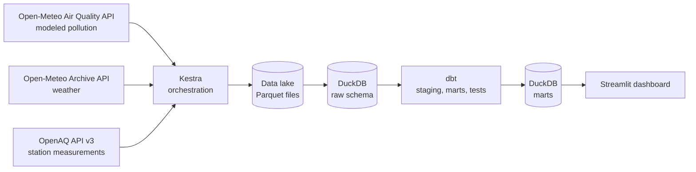
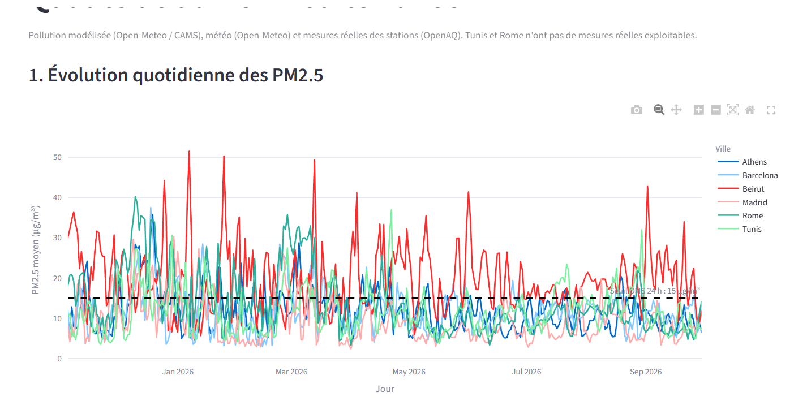
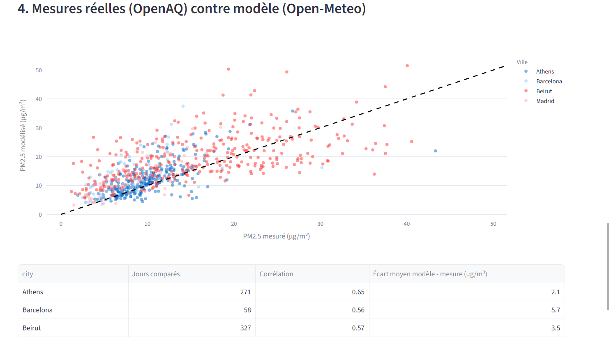
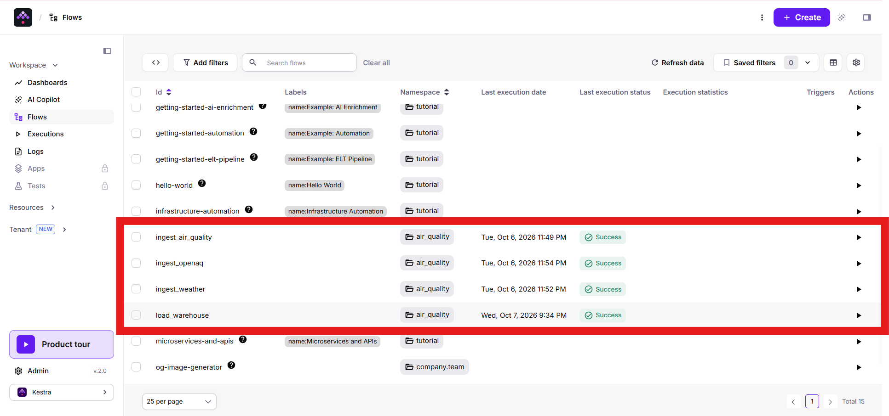
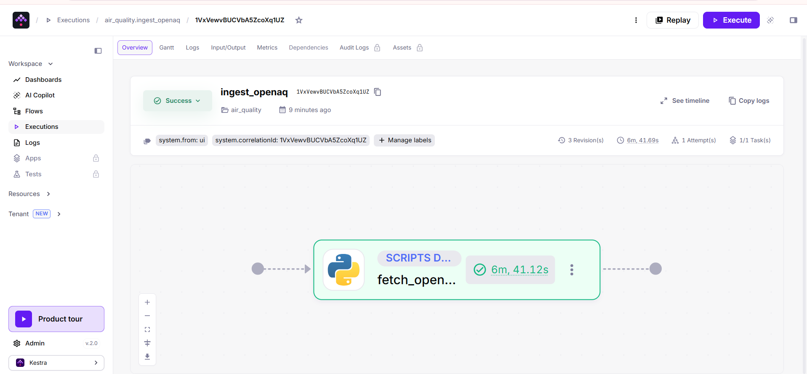

# Mediterranean Air Quality Pipeline

An end-to-end batch data pipeline that collects air quality and weather data for six Mediterranean cities (including Tunis), stores it in a data lake, loads it into a warehouse, transforms it with dbt and serves it through an interactive dashboard.

Built as the final project of a data engineering course. Everything runs locally with free, open-source tools.

## Problem statement

Air pollution is a public health issue across the Mediterranean basin, but ground measurements are unevenly distributed: dense in Southern Europe, almost absent in North Africa. In this project, Tunis, for example, has no station in the OpenAQ network.

The pipeline combines three sources:

- **modeled** pollution data (available everywhere, including Tunis),
- **hourly weather** data,
- **measured** pollution data from monitoring stations (where they exist).

The dashboard answers three questions:

1. How does PM2.5 evolve over time in each city, and how often does it exceed the WHO 24-hour guideline?
2. How are weather conditions, in particular wind, related to pollution levels?
3. How well do the modeled values agree with real station measurements?

**Study period:** 2025-11-05 to 2026-09-30 (330 days, hourly data).

## Architecture



| Layer | Tool |
|---|---|
| Orchestration | Kestra (Docker) |
| Ingestion | Python scripts run by Kestra in containers |
| Data lake | Parquet files partitioned by city, in a Docker volume |
| Warehouse | DuckDB |
| Transformation and tests | dbt Core (dbt-duckdb) |
| Dashboard | Streamlit and Plotly |
| Packaging | Docker and Docker Compose |

## Data sources

| Source | Content | Notes |
|---|---|---|
| Open-Meteo Air Quality API | Modeled PM10, PM2.5, NO2, O3, SO2, CO | Gridded model data, available for any coordinates |
| Open-Meteo Historical Weather API | Temperature, humidity, precipitation, wind speed and direction | Hourly, UTC |
| OpenAQ API v3 | Measured PM2.5 and PM10 from monitoring stations | Requires a free API key |

### Real measurement coverage

| City | Rows ingested (OpenAQ) | Hours with a measured PM2.5 value (out of 7,920) |
|---|---|---|
| Beirut | 7,827 | 7,827 |
| Athens | 27,281 | 6,721 |
| Madrid | 18,322 | 3,115 |
| Barcelona | 12,406 | 1,736 |
| Rome | none | 0 |
| Tunis | none | 0 |

Tunis has no OpenAQ station nearby. Rome has stations, but they only have a few hundred hours of data over the period, so they were excluded by the quality filter. These two cities are analysed with modeled and weather data only.

## Data model

**Raw layer** (loaded from the lake, one table per source):
`raw.air_quality_modeled`, `raw.weather`, `raw.openaq_measurements`

**Staging layer** (dbt views): column renaming, type casting, time zone alignment to UTC, removal of null and negative measurements.

**Marts** (dbt tables):

- `mart_air_quality_hourly`: one row per city and hour, with modeled pollution, weather and (when available) the average measurement across stations.
- `mart_air_quality_daily`: daily averages, precipitation totals, and flags for days above the WHO 24-hour guideline (PM2.5 above 15 µg/m³, PM10 above 45 µg/m³, NO2 above 25 µg/m³). A daily measured average is only computed from at least 18 hourly values.

**Tests** (dbt): not-null and accepted-values checks on cities, uniqueness of the city and hour pair, and plausibility checks on pollution, wind and temperature values.

## Results

The figures below describe the study period (2025-11-05 to 2026-09-30, about 11 months), not a full calendar year.

### 1. Days above the WHO guideline

Share of days where the daily mean PM2.5 (modeled) exceeds 15 µg/m³:

| City | Share of days above 15 µg/m³ |
|---|---|
| Beirut | 69.7% |
| Rome | 29.7% |
| Athens | 23.0% |
| Tunis | 22.1% |
| Barcelona | 20.6% |
| Madrid | 13.6% |

Beirut stands out, with about seven days out of ten above the guideline. The other five cities range from roughly 14% to 30%.

### 2. Wind and pollution

Correlation between the daily mean wind speed and the daily mean PM2.5:

| City | Correlation |
|---|---|
| Tunis | -0.59 |
| Madrid | -0.57 |
| Athens | -0.51 |
| Barcelona | -0.47 |
| Rome | -0.45 |
| Beirut | -0.37 |

The correlation is negative and moderate in all six cities: days with stronger wind tend to have lower PM2.5, which is consistent with pollutants being dispersed. This is a correlation, not proof of causation: both pollution and weather values come from models, and other factors (emissions, season, dust episodes) are not controlled.

### 3. Modeled values against real measurements

Comparison of daily mean PM2.5, using only days with at least 18 hourly measurements:

| City | Days compared | Correlation | Mean difference (model minus measurement) |
|---|---|---|---|
| Madrid | 67 | 0.80 | +4.2 µg/m³ |
| Athens | 271 | 0.65 | +2.1 µg/m³ |
| Beirut | 327 | 0.57 | +3.5 µg/m³ |
| Barcelona | 58 | 0.56 | +5.7 µg/m³ |

The model follows the day-to-day variations of the measurements reasonably well (correlation between 0.56 and 0.80) but is higher than the stations on average, by 2 to 6 µg/m³. Barcelona and Madrid are compared on far fewer days (58 and 67), so their figures are less reliable. On the scatter plot, some of the highest measured days in Beirut appear underestimated by the model.

**What this means for Tunis.** Tunis has no station, so its 22.1% share of days above the guideline rests entirely on modeled data. Since the model is higher than real measurements in the four cities where both exist, this figure may be overestimated, and it cannot be checked locally.

## Screenshots




(docs/dashboard_model_vs_measured2.png)





## Design decisions and limitations

- **Hybrid data on purpose.** Because measurements are missing in North Africa, modeled data is used to include Tunis, and the comparison against real stations is made only where both exist. Modeled and measured values are never mixed in a single series.
- **Station selection.** For each city, stations within 25 km are considered, and up to 3 stations with enough data (at least 25% of the expected hours) are kept. The threshold was tuned after a first run showed that a stricter filter discarded every Madrid station.
- **Coverage gaps.** Madrid and Barcelona stations have many missing hours; this is a property of the source data, not a pipeline failure.
- **Modeled data resolution.** The modeled values come from a regional model on a grid several kilometres wide, so they describe background pollution and not street-level values.
- **Local data lake.** The lake is a set of Parquet files in a Docker volume, not a cloud object store. The storage layout would carry over to an S3-compatible service with limited code changes.
- **No infrastructure as code.** Since everything runs locally, Docker Compose plays that role; no Terraform is used.
- **Flows are triggered manually.** Each flow takes a start and end date as inputs. Daily scheduling triggers are not configured yet.
- **Flow copies.** The Kestra flows in `kestra/flows/` are the reference copies of the flows created in the Kestra interface; they are not synchronised automatically.

## Repository structure

```
.
├── docker-compose.yml        # Kestra, Postgres (Kestra backend) and the dashboard
├── .env.example              # Variables to define in a local .env file
├── kestra/flows/             # ingest_air_quality, ingest_weather, ingest_openaq, load_warehouse
├── dbt/                      # dbt project (staging, marts, tests) and its Dockerfile
├── dashboard/                # Streamlit app and its Dockerfile
└── docs/                     # Screenshots and diagrams
```

## How to reproduce

**Prerequisites:** Docker Desktop and a free OpenAQ API key (https://explore.openaq.org).

1. Clone the repository and go to its folder.

2. Create a `.env` file based on `.env.example`:

   ```
   POSTGRES_PASSWORD=choose_a_password
   SECRET_OPENAQ_API_KEY=<your OpenAQ key encoded in base64>
   ```

   Kestra reads secrets from environment variables starting with `SECRET_`, with a base64-encoded value. Never commit the `.env` file.

3. Create the volume that holds the data lake, then start the services:

   ```
   docker volume create air_quality_lake
   docker compose up -d --build
   ```

4. Open Kestra at http://localhost:8080 and create a local admin account.

5. In Kestra, create the four flows by copying each file from `kestra/flows/`, then run them in this order: `ingest_air_quality`, `ingest_weather`, `ingest_openaq` (about 10 minutes because of API rate limits), then `load_warehouse`. Default dates cover the study period.

6. Build the dbt image and run the transformations and tests (Windows cmd syntax; on Linux or macOS replace `%cd%` with `$(pwd)`):

   ```
   docker build -t air-quality-dbt dbt
   docker run --rm -v "%cd%\dbt:/dbt" -v air_quality_lake:/lake air-quality-dbt dbt build --profiles-dir .
   ```

7. Open the dashboard at http://localhost:8501.

DuckDB allows a single writer: wait until `load_warehouse` or `dbt build` has finished before opening the dashboard.

## Possible extensions

- Daily scheduling with Kestra triggers and incremental loading.
- Deployment on a cloud provider with an object store and Terraform.
- A forecasting model for PM2.5 built on the hourly mart.
- More cities and more stations per city.